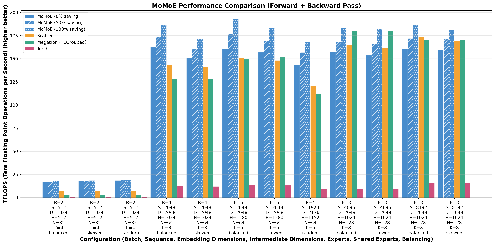
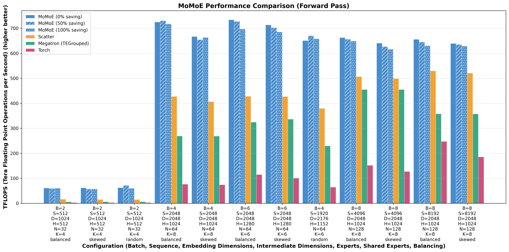
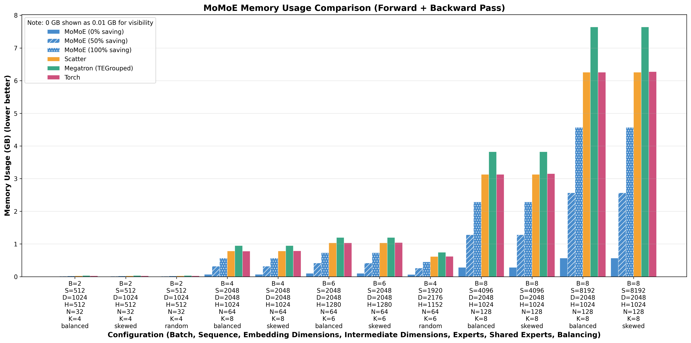

# MoMoE: Memory optimized Mixture of Experts

A hyper-performant SwiGLU MoE kernel, optimized for inference, as well as memory efficiency and customizability during training and finetuning.

To read more about MoMoE, check out [our blog post](https://www.tilderesearch.com/blog/momoe)







## Installation
```bash
# Using uv (recommended pip/conda alternative) pip install
uv pip install git+https://github.com/tilde-research/MoMoE-impl.git

# OR

# Using git clone and uv sync 
git clone https://github.com/tilde-research/MoMoE-impl.git
cd MoMoE-impl
uv sync
source .venv/bin/activate
```

## Usage
```python
import torch
from MoMoE import MoMoE
momoe = MoMoE(
    embedding_dim=2048, 
    intermediate_dim=1024,
    num_experts=128,
    num_chosen_experts=8,
    save_percent=0,
    Wl1_ND2H=None,
    Wl2_NHD=None,
)

x_BSD = torch.randn((B, S, D), device="cuda", dtype=torch.bfloat16, requires_grad=True)

# the two functions below are not real, just put as placeholders for a router
mask_NM, s_NM = get_expert_token_mask(), get_expert_token_weights()

y_BSD, tokens_per_expert_N = momoe(x_BSD, mask_NM, s_NM)
```
## Features
- Customizable amount to save in forward pass (for the backward pass), can be set using `save_percent`, which should be in the range [0, 100]. If this is set to 0, only the minimum will be saved for the backward, recomputing the rest. This allows for high scalability. At the same time, setting it to 100 will save everything we need for the backward (still less than alternate implementations).
- It is also possible to use MoMoE with preallocated weights. Since it is a SwiGLU MoE, we have the first linear layer weights as an `N x D x 2H` tensor and the second linear layer weights as an `N x H x D` tensor. Note that these weights must be contiguous in memory for the Triton kernels to work. **Expert parallelism (i.e. having different experts on different GPUs) is currently not supported.**

## Bonus Repo Features
- This repository also comes equipped with a `TopKRouter` class, which is wrapped together with `MoMoE` into the `MoE` class. If you look in our test file `MoMoE/test.py`, this is what we use.
- The router is a classic `topk` + `softmax` router, equipped with auxiliary loss-free load balancing, as per [this DeepSeek paper](https://arxiv.org/html/2408.15664v1).
- Shared experts, can be set using `shared_experts` in our router. These are experts which are assigned to all tokens, but must also be set in `mask_NM` and `s_NM` accordingly, as a full row of values for **the last `shared_experts` experts _(it will not work as expected unless the shared experts are the last ones)_**

## Acknowledgments
This implementation would not be possible without the wonders of `torch` and `triton`. We thank the PyTorch and Triton teams for everything they have done to help the AI community.

Our implementation is written to fit inside the Flash‑Linear‑Attention project, and we thank the contributors of FLA for their work. We also extend our gratitude to the developers of TorchTitan for providing a platform for LLM pre‑training.

For testing, we thank the Qwen team for the open-sourced MoE models tested. We also wish to thank the Megatron LM, ScatterMoE, and MegaBlocks authors for pioneering the landscape of open-source MoE kernels.

We hope you enjoy our hyper-performant MoE!

```bibtex
@article{costin2025momoe,
    title={MoMoE: Memory optimized Mixture of Experts},
    author={Costin, Bobby and Averbuch, Timor and Pai, Dhruv and Chen, Nathan and Keigwin, Ben},
    journal={Tilde Research Blog},
    year={2025},
    month={7},
    url={https://www.tilderesearch.com/blog/momoe},
    note={Blog post}
}
```